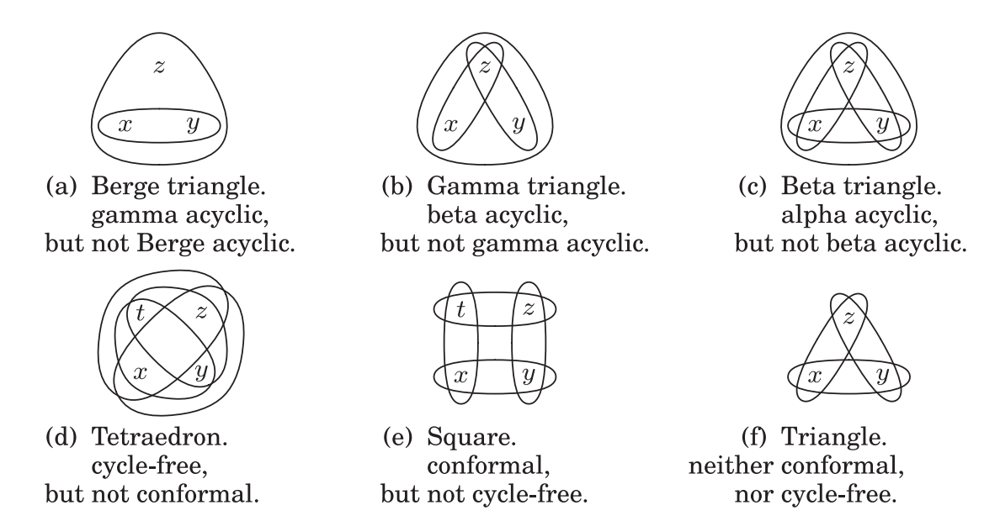

# Hypergraph
A hypergraph $H$ is defined as a pair:
$$H = (V, E)$$
where:
- $V$ is a set of vertices.
- $E$ is a set of hyperedges, where each hyperedge is a subset of $V$, i.e., $E \subseteq \mathcal{P}(V)$.

# Alpha $\alpha$ Cycle
An **alpha cycle** is a sequence of hyperedges $(E_1, E_2, \ldots, E_k) (k\geq 3)$ where the $E_i$ are distincet hypergraphs:
1. For each pair of $E_i$ and $E_{i+1}$ (we identify $E_{n+1}$ with $E_1$), their intersection is non-empty and is $\alpha$ neighboring (there is no suquence of neighborhood between them):
   $$E_i \cap E_{i+1} \neq \emptyset, \quad \forall i \in \{1, 2, \ldots, k\}$$
2. Not exist $a,b$ such that
   $$E_a \cap E_{a+1} \in E_b \cap E_{b+1}$$

# Beta $\beta$ Cycle
A **beta cycle** is a sequence $(E_1, x_1,\cdots, E_n, x_n, E_{n+1}) (n\geq 3)$ where the $E_i$ are distinct hyperedges and the $x_i$ are distinct vertices, and satisfying the following properties:
1. for all $i \in [1, n-1]$, $x_i$ belongs to $E_i$ and $E_{i+1}$ and no other $E_i$

# Gamma $\gamma$ Cycle
A **gamma cycle** is a sequence $(E_1, x_1,\cdots, E_n, x_n, E_{n+1}) (n\geq 3)$ where the $E_i$ are distinct hyperedges and the $x_i$ are distinct vertices, and satisfying the following properties:
1. for all $i \in [1, n-1]$, $x_i$ belongs to $E_i$ and $E_{i+1}$ and no other $E_i$
2. $x_n$ belongs to $E_n$ and $E_1$ (and possibly to other $E_j$)

# Berge Cycle
A **Berge cycle** is a sequence $(E_1, x_1,\cdots, E_n, x_n, E_{n+1}) (n\geq 2)$ where the $E_i$ are distinct hyperedges and the $x_i$ are distinct vertices, and satisfying the following properties:
1. For all $i \in [1, n]$, $x_i$ in $E_i$ and $E_{i+1}$

# Relationships
Cycle restriction:
$$\alpha \subset \beta \subset \gamma \subset Berge$$

Acyclicity:
$$Berge \subset \gamma \subset \beta \subset \alpha$$

# Example (Acylic)

| ID           | $\alpha$ Acylic| $\beta$ Acylic| $\gamma$ Acylic|
|:-------------|:--------------:|--------------:|---------------:|
| a            |      True      |      True     |      True      |
| b            |      True      |      True     |      False     |
| c            |      True      |      False    |      False     |
| d            |      False     |     False     |      False     |
| e            |      False     |     False     |      False     |
| f            |      False     |     False     |      False     |

